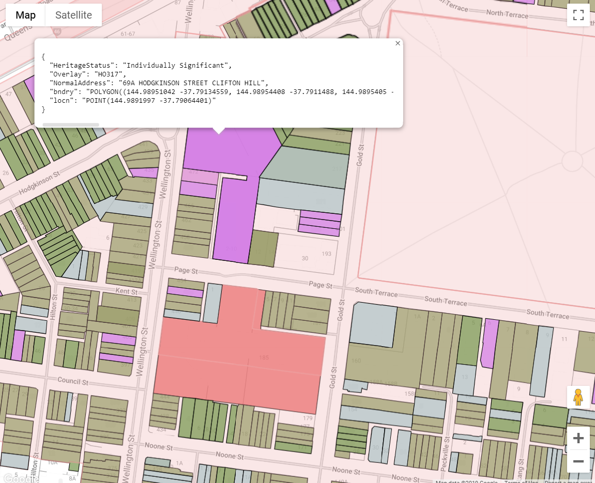

# Yarra Heritage Maps  

Web App to display a map of Heritage Overlays, Heritage Gradings and Heritage Data for properites in the City of Yarra
A heritage overlay can be selected with double-click to see properties and applications inside the overlay.

Relies on Tables in Biq Query



## Getting started

- Documentation: https://cloud.google.com/bigquery/docs/gis-analyst-start

## Terms

This tool is provided as is for educational purposes. 

It is not a substitue for the reference planning documentation.

cd ya**Data may be incorrect, incomplete or out of date!**

For planning matters, always refer to the reference documents for reliable information:

### Yarra Planning Scheme
- [Yarra Planning Scheme](http://planningschemes.dpcd.vic.gov.au/schemes/yarra)
- [Yarra Planning Scheme Heritage Overlay Maps](http://planningschemes.dpcd.vic.gov.au/schemes/yarra/maps)
- [City of Yarra Heritage review Appendix 8](https://www.yarracity.vic.gov.au/the-area/planning-for-yarras-future/yarra-planning-scheme-and-amendments/incorporated-documents)
- [Victorian Heritage Database](https://vhd.heritagecouncil.vic.gov.au)
-- [Clause 43.01 HERITAGE OVERLAY](http://planningschemes.dpcd.vic.gov.au/schemes/vpps/43_01.pdf)
-- [Clause 43.01 SCHEDULE TO THE HERITAGE OVERLAY](http://planningschemes.dpcd.vic.gov.au/schemes/yarra/ordinance/43_01s_yara.pdf)
-- [Clause 22.02 DEVELOPMENT GUIDELINES FOR SITES SUBJECT TO THE HERITAGE OVERLAY](http://planningschemes.dpcd.vic.gov.au/schemes/yarra/ordinance/22_lpp02_yara.pdf)

## Development

### Quickstart

```shell
# Start a dev server at http://localhost:4200/.
npm run dev

# Run unit tests with Karma.
npm test
```
### Resources

- [Google Maps JavaScript API documentation](https://developers.google.com/maps/documentation/javascript/)
- [Google BigQuery REST API documentation](https://cloud.google.com/bigquery/docs/reference/rest/v2/)
- [Angular](https://angular.io/)
- [D3.js](https://d3js.org/)
- [TypeScript](https://www.typescriptlang.org/)
